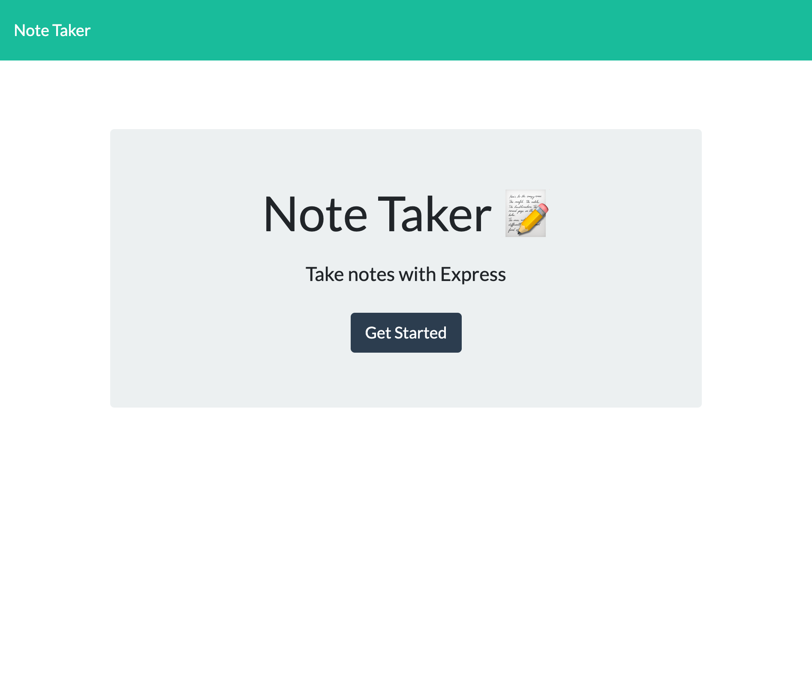
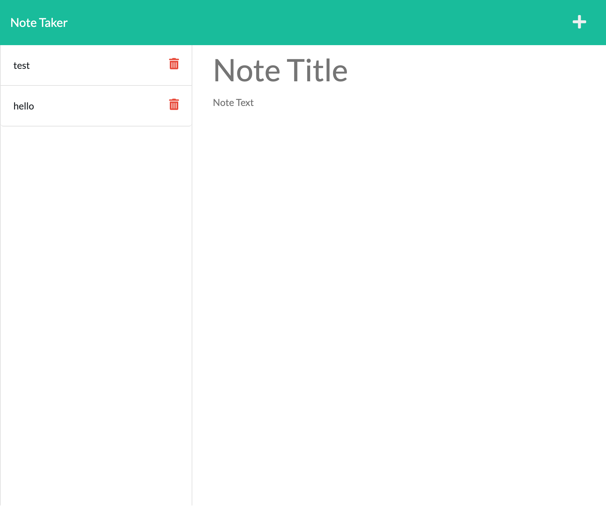

<h1 align="center">Welcome to Note Taker👋</h1>
<p>
  
  <a href="https://github.com/Brainybrian316/Note-Taker#readme" target="_blank">
    
  </a>
  <a href="https://github.com/Brainybrian316/Note-Taker/graphs/commit-activity" target="_blank">
    
  </a>
  <a href="https://opensource.org/licenses/MIT" target="_blank">
    
  </a>
</p>

> A backend development project that host an application called Note Taker that can be used to write and save notes. This application uses Express.js back end that will save and retrieve note data from a JSON file. The applications front end was already created by another team. Therefore, my contribution to the code was only the backend. The application is also deployed on Heroku.


***
## Demo of Project 

### 🏠 [Homepage](https://note-taker-brainybrian316.herokuapp.com/)
### ✨ [Live Demo](https://user-images.githubusercontent.com/99369106/166121471-cee5e726-2b13-4b38-923d-a61843815313.mp4)

<p>This is what the homepage looks like:</p>



<p>This is what it looks like in the notes section when you click get started:</p>



***
## Install

```sh
npm install
```
***
## Usage

```sh
npm start
```

***
## Author

👤 **Brainybrian316**

* Website: https://brainybrian316.com/
* Github: [@Brainybrian316](https://github.com/Brainybrian316)
* LinkedIn: [@brainybrian316](https://linkedin.com/in/brainybrian316)
***

## 🤝 Contributing


Contributions, issues and feature requests are welcome!<br />Feel free to check [issues page](https://github.com/Brainybrian316/Note-Taker/issues). You can also take a look at the contributing guide below: 
&nbsp;

Contributions are what make the open source community such an amazing place to learn, inspire, and create. Any contributions you make are greatly appreciated.

If you have a suggestion that would make this better, please fork the repo and create a pull request. You can also simply open an issue with the tag "enhancement". Don't forget to give the project a star! Thanks again!

1. Fork the Project

2. Create your Feature Branch (git checkout -b feature/AmazingFeature)

3. Commit your Changes (git commit -m 'Add some AmazingFeature')

4. Push to the Branch (git push origin feature/AmazingFeature)

5. Open a Pull Request

***
## Show your support


<p> Give a ⭐️ if this project helped you! </p>
<p> Buy me a coffee by becoming a patreon ☕️ </p>

<a href="https://www.patreon.com/brainybrian316">
  
</a>

***
## 📝 License

Copyright © 2022 [Brainybrian316](https://github.com/Brainybrian316).<br />
This project is [ISC](https://opensource.org/licenses/MIT) licensed.

***